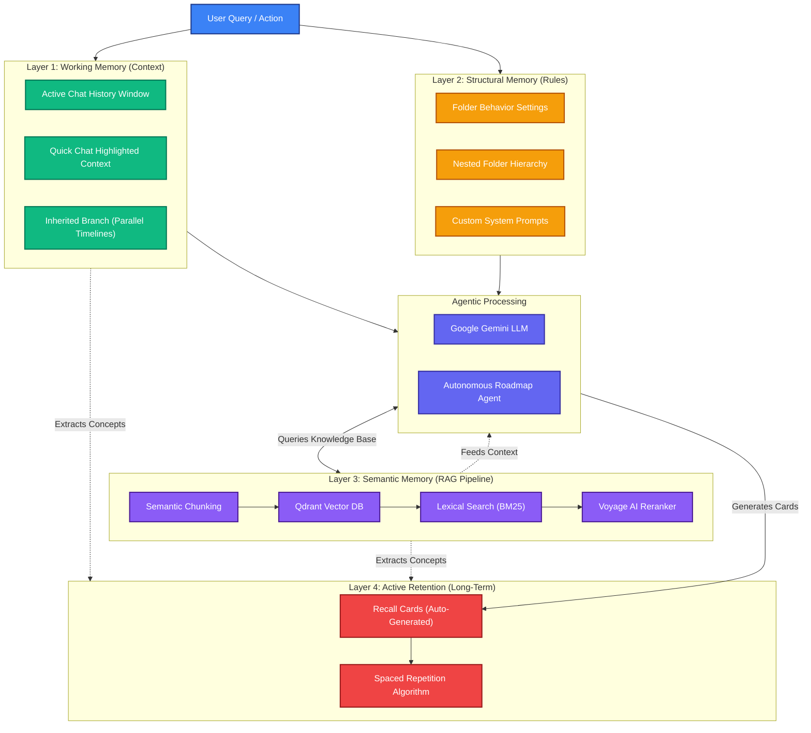

# Nurons (Dentrites) 4-Layer Memory Architecture

This diagram visualizes how the AI processes user intent through four distinct memory layers, preventing context loss and enabling autonomous learning.

