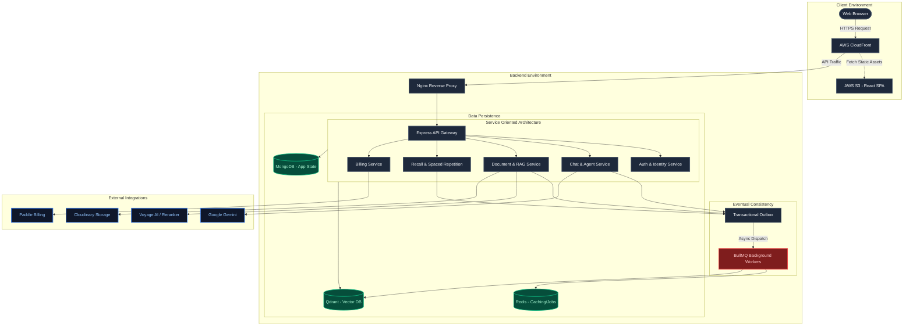

# Nurons System Architecture

Nurons is designed as a highly scalable, decoupled web application. It utilizes a Service-Oriented Architecture (SOA), background task queues, and the Transactional Outbox pattern to ensure eventual consistency and reliability under heavy AI workloads.

## High-Level Architecture Diagram

## Core Architectural Concepts

1. **Frontend Edge Delivery:** The React frontend is compiled and stored in an S3 bucket, served globally via AWS CloudFront for sub-second load times.
2. **Service-Oriented Architecture (SOA):** The Express backend delegates business logic to specialized services (`ChatService`, `RAGService`). This separation of concerns allows for easier testing and future microservice extraction.
3. **Transactional Outbox & Eventual Consistency:** To avoid dual-write failures (e.g., saving a user to MongoDB but failing to enqueue a Redis job), database writes and job dispatches are tied together using the Outbox pattern. Background workers process heavy tasks (like semantic chunking) to maintain eventual consistency.
4. **Vector & Semantic Search Pipeline:** Qdrant is used in tandem with Voyage AI embeddings to process uploaded documents asynchronously, enabling lightning-fast Retrieval-Augmented Generation (RAG).
