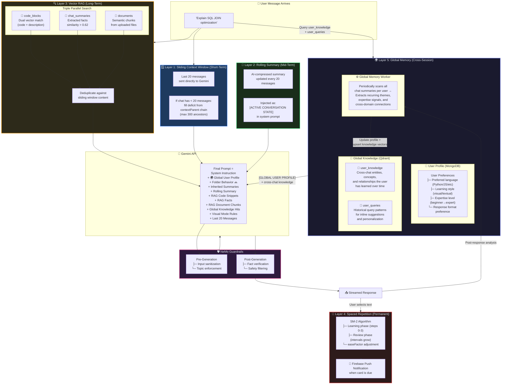
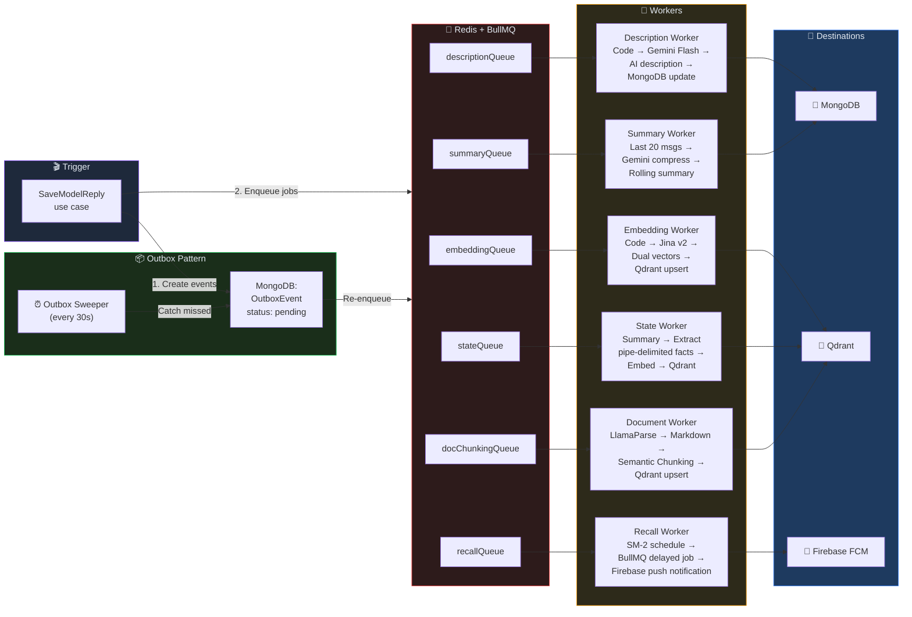
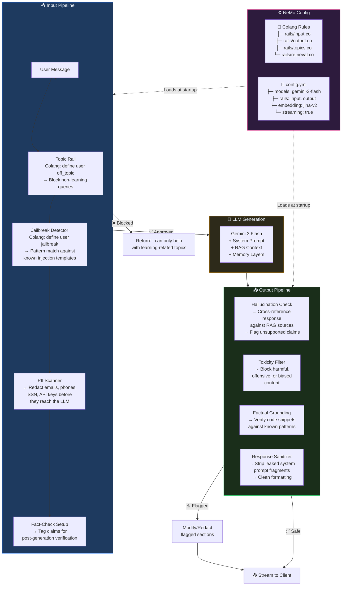

# 🧬 Dendrites — High-Level System Architecture Diagrams

> Copy any of the Mermaid code blocks below and paste into [mermaid.live](https://mermaid.live) or any Mermaid-compatible renderer.

---

## 1. Full System Architecture (Bird's Eye View)

```mermaid
graph TB
    %% ─── CLIENT LAYER ───
    subgraph CLIENT["🌐 Client Layer"]
        direction LR
        Browser["🖥️ React + Vite SPA<br/>├─ Redux Toolkit (Auth/Explorer State)<br/>├─ TanStack React Query (Server State)<br/>├─ React Router v6<br/>├─ react-virtuoso (Virtual Scroll)<br/>└─ Firebase SDK (FCM Registration)"]
    end

    %% ─── LOAD BALANCER ───
    LB["⚖️ Nginx / Reverse Proxy<br/>├─ SSL Termination<br/>├─ Rate Limiting<br/>├─ Gzip Compression<br/>└─ Static Asset Serving"]

    %% ─── API GATEWAY ───
    subgraph BACKEND["🏗️ Backend Layer (Node.js + Express)"]
        direction TB

        MW["🛡️ Middleware Stack<br/>├─ CORS<br/>├─ Cookie Parser<br/>├─ Auth Middleware (JWT verify)<br/>├─ Error Handler<br/>└─ 🔜 Rate Limiter (per tier)"]

        subgraph GUARDRAILS["🛡️ NeMo Guardrails"]
            direction LR
            InputGuard["📥 Input Guard<br/>├─ Topic Filtering<br/>├─ Jailbreak Detection<br/>├─ PII Redaction<br/>└─ Prompt Injection Shield"]
            OutputGuard["📤 Output Guard<br/>├─ Hallucination Check<br/>├─ Toxicity Filter<br/>├─ Factual Grounding<br/>└─ Response Sanitization"]
        end

        subgraph CONTROLLERS["🎮 Controllers"]
            direction LR
            AuthCtrl["Auth"]
            ChatCtrl["Chat"]
            FolderCtrl["Folder"]
            RecallCtrl["Recall"]
            BranchCtrl["Branch"]
            AdminCtrl["🔜 Admin"]
            BillingCtrl["🔜 Billing"]
            SuggestCtrl["🔜 Suggestions"]
        end

        subgraph USECASES["⚙️ Application Layer (36 Use Cases)"]
            direction LR
            AuthUC["Auth<br/>6 use cases"]
            ChatUC["Chat<br/>10 use cases"]
            FolderUC["Folder<br/>4 use cases"]
            RecallUC["Recall<br/>6 use cases"]
            BranchUC["Branch<br/>2 use cases"]
            WorkerUC["Workers<br/>6 use cases"]
            SchedulerUC["Schedulers<br/>2 use cases"]
        end

        subgraph SERVICES["🔧 Services"]
            direction LR
            AISvc["AIService<br/>├─ Search Routing<br/>├─ Stream with Retry<br/>└─ Anchor Context Cache"]
            EmbSvc["EmbeddingService<br/>└─ Jina v2 Wrapper"]
            ChunkSvc["SemanticChunkingService<br/>├─ Markdown Parser<br/>├─ Boundary Detection<br/>└─ Token Enforcement"]
            FileSvc["FileUploadService<br/>├─ MIME Validation<br/>└─ Cloudinary Upload"]
            SearchSvc["SearchCacheService<br/>└─ Tavily + Qdrant Cache"]
            PubSubSvc["DocumentProgressPubSub<br/>└─ Redis Pub/Sub"]
        end
    end

    %% ─── ASYNC PIPELINE ───
    subgraph ASYNC["⚡ Async Processing Pipeline"]
        direction TB
        subgraph QUEUES["📬 BullMQ Queues"]
            direction LR
            Q1["embeddingQueue"]
            Q2["descriptionQueue"]
            Q3["summaryQueue"]
            Q4["stateQueue"]
            Q5["recallQueue"]
            Q6["documentChunkingQueue"]
        end

        subgraph WORKERS["👷 Workers (6)"]
            direction LR
            W1["Embedding Worker<br/>Code → Dual Vector"]
            W2["Description Worker<br/>Code → AI Description"]
            W3["Summary Worker<br/>Messages → Rolling Summary"]
            W4["State Worker<br/>Summary → Facts → Vectors"]
            W5["Recall Worker<br/>Card → Schedule + Notify"]
            W6["Document Worker<br/>PDF → Chunks → Vectors"]
        end

        subgraph CRON["⏰ Cron Sweepers (3)"]
            direction LR
            C1["Outbox Sweeper<br/>every 30s"]
            C2["Description Sweeper<br/>every 60s"]
            C3["Search Cache Sweeper<br/>every 6h"]
        end
    end

    %% ─── DATA LAYER ───
    subgraph DATA["💾 Data Layer"]
        direction LR
        subgraph MONGO["🍃 MongoDB"]
            direction TB
            Users["users"]
            Chats["chats"]
            Messages["messages"]
            Folders["folders"]
            CodeBlocks["codeblocks"]
            SubChats["subchats"]
            Recalls["recalls"]
            OutboxEvents["outboxevents"]
        end

        subgraph REDIS_DB["🔴 Redis"]
            direction TB
            SessionCache["Session Cache<br/>Anchor Context"]
            JobBroker["BullMQ Job Broker"]
            PubSubChannel["Pub/Sub Channels<br/>Document Progress"]
            OTPStore["🔜 OTP Store (TTL)"]
        end

        subgraph QDRANT["🔷 Qdrant Vector DB"]
            direction TB
            CodeColl["code_blocks<br/>Dual Vector (code + desc)<br/>768-dim"]
            SummaryColl["chat_summaries<br/>Single Vector<br/>768-dim"]
            SearchColl["search_cache<br/>Tavily Results<br/>768-dim"]
            DocColl["documents<br/>Semantic Chunks<br/>768-dim"]
        end
    end

    %% ─── EXTERNAL SERVICES ───
    subgraph EXTERNAL["☁️ External Services / Third-Party APIs"]
        direction LR
        Gemini["🤖 Google Gemini API<br/>├─ gemini-3-flash-preview (main)<br/>├─ gemini-2.5-flash-lite (router)<br/>└─ Multi-key rotation pool"]
        Infinity["🧮 Infinity Server (Local)<br/>├─ Jina v2 Base Code<br/>├─ 768-dim embeddings<br/>└─ Batch support"]
        Tavily["🔍 Tavily Search API<br/>└─ Real-time web search"]
        Cloudinary["☁️ Cloudinary CDN<br/>├─ Image uploads<br/>└─ Document storage"]
        LlamaParse["📄 LlamaParse<br/>├─ PDF → Markdown<br/>└─ Agentic tier"]
        Firebase["🔔 Firebase Cloud Messaging<br/>└─ Push Notifications"]
        Stripe["💳 🔜 Stripe<br/>├─ Checkout Sessions<br/>├─ Webhooks<br/>└─ Customer Portal"]
        NeMo["🛡️ NVIDIA NeMo<br/>├─ Guardrails Server<br/>├─ Colang Rules<br/>└─ Content Safety"]
    end

    %% ─── CONNECTIONS ───
    Browser -->|"HTTPS / SSE Streams"| LB
    LB -->|"Proxy Pass"| MW
    MW --> CONTROLLERS
    CONTROLLERS --> InputGuard
    InputGuard --> USECASES
    USECASES --> SERVICES
    USECASES --> OutputGuard
    OutputGuard -->|"Sanitized Response"| CONTROLLERS

    SERVICES --> MONGO
    SERVICES --> REDIS_DB
    SERVICES --> QDRANT
    SERVICES --> Gemini
    SERVICES --> Infinity
    SERVICES --> Tavily
    SERVICES --> Cloudinary
    SERVICES --> LlamaParse

    CONTROLLERS -->|"Enqueue Jobs"| QUEUES
    QUEUES --> WORKERS
    WORKERS --> MONGO
    WORKERS --> QDRANT
    WORKERS --> Infinity
    WORKERS --> Gemini
    WORKERS --> Firebase
    WORKERS --> NeMo

    CRON --> MONGO
    CRON --> QDRANT

    PubSubSvc --> PubSubChannel

    %% ─── STYLING ───
    classDef clientStyle fill:#1e3a5f,stroke:#3b82f6,stroke-width:2px,color:#e2e8f0
    classDef backendStyle fill:#1e293b,stroke:#8b5cf6,stroke-width:2px,color:#e2e8f0
    classDef asyncStyle fill:#1a2332,stroke:#f59e0b,stroke-width:2px,color:#e2e8f0
    classDef dataStyle fill:#1a2e1a,stroke:#22c55e,stroke-width:2px,color:#e2e8f0
    classDef externalStyle fill:#2d1b1b,stroke:#ef4444,stroke-width:2px,color:#e2e8f0
    classDef guardrailStyle fill:#2d1b3d,stroke:#ec4899,stroke-width:2px,color:#e2e8f0

    class CLIENT clientStyle
    class BACKEND backendStyle
    class ASYNC asyncStyle
    class DATA dataStyle
    class EXTERNAL externalStyle
    class GUARDRAILS guardrailStyle
```

---

## 2. Request Flow — Message Send Pipeline (with NeMo Guardrails)

```mermaid
sequenceDiagram
    autonumber
    participant U as 🖥️ Browser
    participant LB as ⚖️ Nginx
    participant MW as 🛡️ Auth Middleware
    participant IG as 🛡️ NeMo Input Guard
    participant C as 🎮 ChatController
    participant PM as ⚙️ PrepareMessage
    participant EMB as 🧮 Infinity (Jina v2)
    participant Q as 🔷 Qdrant
    participant R as 🔴 Redis
    participant AI as 🤖 Gemini API
    participant OG as 🛡️ NeMo Output Guard
    participant SM as ⚙️ SaveModelReply
    participant DB as 🍃 MongoDB
    participant BQ as 📬 BullMQ

    U->>LB: POST /chats/:id/message (SSE)
    LB->>MW: Proxy + Rate Check
    MW->>MW: Verify JWT Cookie
    MW->>IG: Forward user message

    rect rgb(45, 27, 61)
        Note over IG: NeMo Input Guardrails
        IG->>IG: Topic Filter (block off-topic)
        IG->>IG: Jailbreak Detection
        IG->>IG: PII Redaction
        IG-->>C: ✅ Approved / ❌ Blocked
    end

    C->>PM: execute(chatId, userId, message)

    par Dual Embedding
        PM->>EMB: embed(message, CODE_RETRIEVAL)
        PM->>EMB: embed(message, RETRIEVAL_QUERY)
    end

    par Triple Vector Search
        PM->>Q: searchSimilarCode(codeVec, descVec, chatIds[])
        PM->>Q: searchSimilarChatChunk(descVec, chatIds[])
        PM->>Q: searchDocuments(query, descVec, chatIds[])
    end

    PM->>DB: findRecentMessages(chatId, 20)

    opt Sliding Window Deficit
        PM->>DB: findRecentMessages(parentChatId, deficit)
        Note over PM,DB: Traverse contextParent chain
    end

    PM->>PM: Build System Prompt<br/>+ Inherited Summaries<br/>+ RAG Context<br/>+ Mode Instructions

    PM-->>C: { contents, chat }

    C->>AI: generateContentStream(contents)

    loop SSE Chunks
        AI-->>OG: Raw AI chunk

        rect rgb(45, 27, 61)
            Note over OG: NeMo Output Guardrails
            OG->>OG: Hallucination Check
            OG->>OG: Toxicity Filter
            OG->>OG: Factual Grounding
        end

        OG-->>U: data: {"text": "..."}
    end

    AI-->>C: Stream complete

    C->>SM: execute(chatId, fullResponse)
    SM->>DB: Save model message
    SM->>SM: Extract code blocks (SHA-256 dedup)
    SM->>DB: Save code blocks
    SM->>DB: Create OutboxEvents
    SM->>BQ: Enqueue: embedding, summary, state jobs

    C-->>U: data: {"type":"metadata", ids...}
    C-->>U: data: [DONE]
```

---

## 3. AI Memory System — 5-Layer Architecture

---

## 4. Async Processing Pipeline (Workers + Outbox)

---

## 5. NeMo Guardrails Integration Detail

---

## 📋 Quick Reference: Copy-Paste Guide

| Diagram | What it shows | Best for |
|---|---|---|
| **Diagram 1** | Full system topology with all components | README, project overview |
| **Diagram 2** | Request lifecycle for sending a message | Technical documentation |
| **Diagram 3** | 4-layer memory architecture | Feature explanation |
| **Diagram 4** | Async worker pipeline | DevOps / infrastructure docs |
| **Diagram 5** | NeMo Guardrails integration | Security / safety documentation |

> 💡 **Tip:** Paste any code block into [mermaid.live](https://mermaid.live) to preview and export as SVG/PNG.
