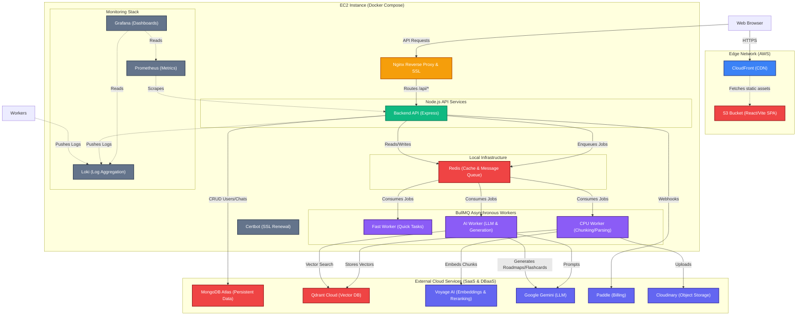

# Nurons (Dentrites) System Architecture

This diagram maps out the full deployment architecture, including the Dockerized microservices, background workers, observability stack, and external cloud services.

Wait, standard Mermaid for architecture is a graph or architecture diagram. Let's use `graph TD`.

